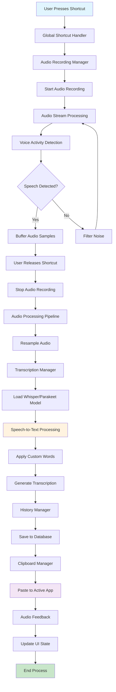
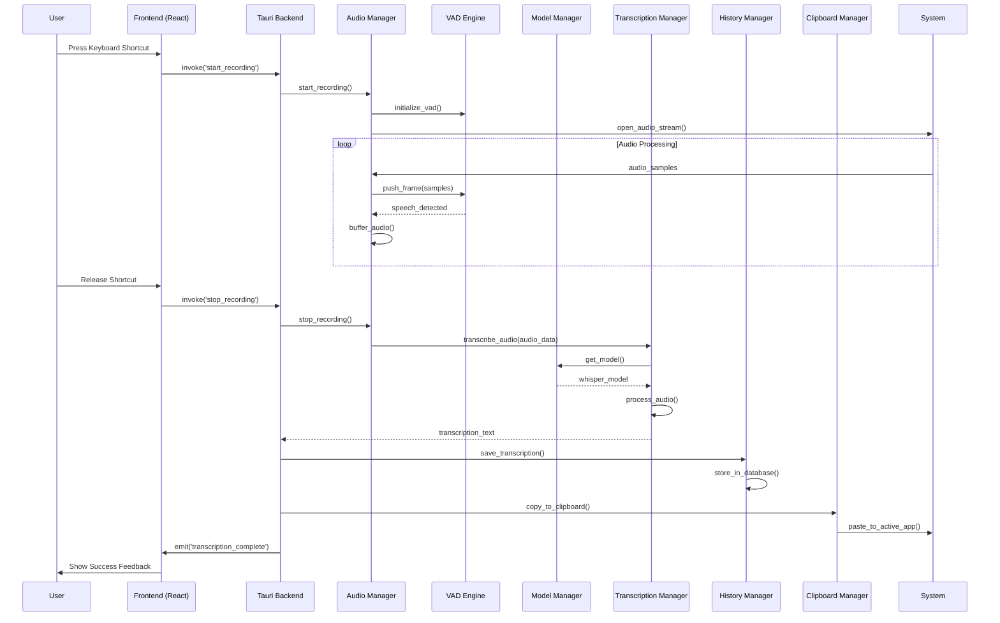
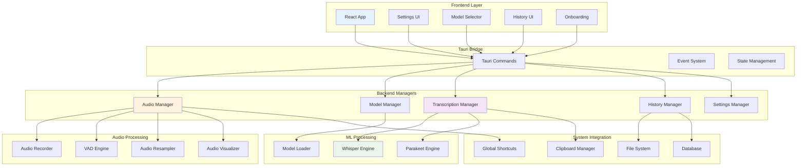
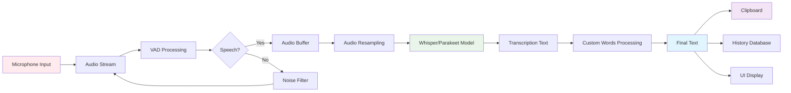
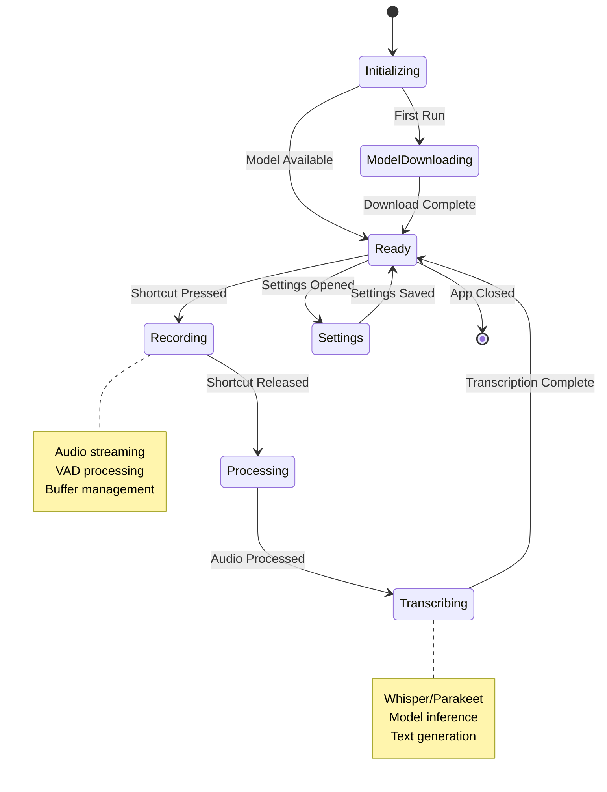

# Handy Application Flow Diagram

```mermaid
flowchart TD
    A[User Presses Shortcut] --> B[Global Shortcut Handler]
    B --> C[Audio Recording Manager]
    C --> D[Start Audio Recording]
    D --> E[Audio Stream Processing]
    E --> F[Voice Activity Detection]
    F --> G{Speech Detected?}
    G -->|Yes| H[Buffer Audio Samples]
    G -->|No| I[Filter Noise]
    I --> E
    H --> J[User Releases Shortcut]
    J --> K[Stop Audio Recording]
    K --> L[Audio Processing Pipeline]
    L --> M[Resample Audio]
    M --> N[Transcription Manager]
    N --> O[Load Whisper/Parakeet Model]
    O --> P[Speech-to-Text Processing]
    P --> Q[Apply Custom Words]
    Q --> R[Generate Transcription]
    R --> S[History Manager]
    S --> T[Save to Database]
    T --> U[Clipboard Manager]
    U --> V[Paste to Active App]
    V --> W[Audio Feedback]
    W --> X[Update UI State]
    X --> Y[End Process]

    style A fill:#e1f5fe
    style Y fill:#c8e6c9
    style P fill:#fff3e0
    style V fill:#f3e5f5
```

## 2. System Architecture Communication Diagram

```mermaid
sequenceDiagram
    participant U as User
    participant F as Frontend (React)
    participant T as Tauri Backend
    participant A as Audio Manager
    participant V as VAD Engine
    participant M as Model Manager
    participant Tr as Transcription Manager
    participant H as History Manager
    participant C as Clipboard Manager
    participant S as System

    U->>F: Press Keyboard Shortcut
    F->>T: invoke('start_recording')
    T->>A: start_recording()
    A->>V: initialize_vad()
    A->>S: open_audio_stream()
    
    loop Audio Processing
        S->>A: audio_samples
        A->>V: push_frame(samples)
        V-->>A: speech_detected
        A->>A: buffer_audio()
    end
    
    U->>F: Release Shortcut
    F->>T: invoke('stop_recording')
    T->>A: stop_recording()
    A->>Tr: transcribe_audio(audio_data)
    Tr->>M: get_model()
    M-->>Tr: whisper_model
    Tr->>Tr: process_audio()
    Tr-->>T: transcription_text
    T->>H: save_transcription()
    H->>H: store_in_database()
    T->>C: copy_to_clipboard()
    C->>S: paste_to_active_app()
    T->>F: emit('transcription_complete')
    F->>U: Show Success Feedback
```

## 3. Component Architecture Diagram

```mermaid
graph TB
    subgraph "Frontend Layer"
        A[React App]
        B[Settings UI]
        C[Model Selector]
        D[History UI]
        E[Onboarding]
    end
    
    subgraph "Tauri Bridge"
        F[Tauri Commands]
        G[Event System]
        H[State Management]
    end
    
    subgraph "Backend Managers"
        I[Audio Manager]
        J[Model Manager]
        K[Transcription Manager]
        L[History Manager]
        M[Settings Manager]
    end
    
    subgraph "Audio Processing"
        N[Audio Recorder]
        O[VAD Engine]
        P[Audio Resampler]
        Q[Audio Visualizer]
    end
    
    subgraph "ML Processing"
        R[Whisper Engine]
        S[Parakeet Engine]
        T[Model Loader]
    end
    
    subgraph "System Integration"
        U[Global Shortcuts]
        V[Clipboard Manager]
        W[File System]
        X[Database]
    end
    
    A --> F
    B --> F
    C --> F
    D --> F
    E --> F
    
    F --> I
    F --> J
    F --> K
    F --> L
    F --> M
    
    I --> N
    I --> O
    I --> P
    I --> Q
    
    K --> R
    K --> S
    J --> T
    
    I --> U
    K --> V
    L --> W
    L --> X
    
    style A fill:#e3f2fd
    style I fill:#fff3e0
    style K fill:#f3e5f5
    style R fill:#e8f5e8
```

## 4. Data Flow Diagram

```mermaid
flowchart LR
    A[Microphone Input] --> B[Audio Stream]
    B --> C[VAD Processing]
    C --> D{Speech?}
    D -->|Yes| E[Audio Buffer]
    D -->|No| F[Noise Filter]
    F --> B
    E --> G[Audio Resampling]
    G --> H[Whisper/Parakeet Model]
    H --> I[Transcription Text]
    I --> J[Custom Words Processing]
    J --> K[Final Text]
    K --> L[Clipboard]
    K --> M[History Database]
    K --> N[UI Display]
    
    style A fill:#ffebee
    style H fill:#e8f5e8
    style K fill:#e1f5fe
    style L fill:#f3e5f5
```

## 5. State Management Flow

```mermaid
stateDiagram-v2
    [*] --> Initializing
    Initializing --> ModelDownloading: First Run
    Initializing --> Ready: Model Available
    ModelDownloading --> Ready: Download Complete
    Ready --> Recording: Shortcut Pressed
    Recording --> Processing: Shortcut Released
    Processing --> Transcribing: Audio Processed
    Transcribing --> Ready: Transcription Complete
    Ready --> Settings: Settings Opened
    Settings --> Ready: Settings Saved
    Ready --> [*]: App Closed
    
    note right of Recording
        Audio streaming
        VAD processing
        Buffer management
    end note
    
    note right of Transcribing
        Whisper/Parakeet
        Model inference
        Text generation
    end note
```
