# Maivi Application Architecture Diagrams

## 1. System Architecture & Communication Diagram

## 2. Application Flow Diagram

## 3. Data Flow Diagram

```mermaid
flowchart LR
    subgraph "Audio Input"
        Microphone[🎤 Microphone]
        AudioStream[Audio Stream<br/>16kHz, Mono]
    end
    
    subgraph "Audio Processing"
        SoundDevice[SoundDevice<br/>Real-time Capture]
        AudioBuffer[Audio Buffer<br/>7s Window]
        ChunkQueue[Chunk Queue<br/>3s Intervals]
    end
    
    subgraph "Transcription Pipeline"
        NeMoModel[NVIDIA NeMo<br/>Parakeet TDT 0.6B]
        ChunkText[Chunk Text<br/>Raw Transcription]
        ChunkMerger[Chunk Merger<br/>Overlap Detection]
        MergedText[Merged Text<br/>Final Result]
    end
    
    subgraph "Output Processing"
        Clipboard[📋 Clipboard<br/>pyperclip]
        AutoPaste[Auto-Paste<br/>Ctrl+V Simulation]
        FileSave[💾 File Save<br/>WAV Recording]
        Notification[🔔 Notification<br/>User Feedback]
    end
    
    subgraph "User Interface"
        GUI[🖥️ Qt Overlay<br/>Real-time Display]
        CLI[💻 Terminal UI<br/>Live Updates]
        Keyboard[⌨️ Keyboard Input<br/>Cmd+Q Hotkey]
    end
    
    %% Data Flow
    Microphone --> AudioStream
    AudioStream --> SoundDevice
    SoundDevice --> AudioBuffer
    AudioBuffer --> ChunkQueue
    ChunkQueue --> NeMoModel
    NeMoModel --> ChunkText
    ChunkText --> ChunkMerger
    ChunkMerger --> MergedText
    MergedText --> Clipboard
    MergedText --> AutoPaste
    MergedText --> GUI
    MergedText --> CLI
    AudioStream --> FileSave
    Clipboard --> Notification
    Keyboard --> SoundDevice
    
    %% Styling
    classDef audio fill:#e3f2fd
    classDef processing fill:#f3e5f5
    classDef transcription fill:#fff3e0
    classDef output fill:#e8f5e8
    classDef ui fill:#fce4ec
    
    class Microphone,AudioStream audio
    class SoundDevice,AudioBuffer,ChunkQueue processing
    class NeMoModel,ChunkText,ChunkMerger,MergedText transcription
    class Clipboard,AutoPaste,FileSave,Notification output
    class GUI,CLI,Keyboard ui
```

## 4. Component Interaction Sequence

## 5. Threading Architecture

## Key Features of Maivi Architecture:

### 1. **Modular Design**
- Clear separation between GUI, CLI, and core processing
- Pluggable components for different interfaces
- Independent audio processing and transcription

### 2. **Real-time Processing**
- Streaming audio capture with overlapping chunks
- Parallel processing of audio chunks during recording
- Live UI updates with transcription progress

### 3. **Smart Chunk Merging**
- 7-second chunks with 4-second overlap
- Overlap detection for seamless merging
- No word cutting or complex algorithms

### 4. **Cross-platform Support**
- Qt for GUI (Windows, macOS, Linux)
- SoundDevice for audio (better ARM64 support)
- Platform-specific file storage

### 5. **Performance Optimized**
- CPU-only processing (no GPU required)
- Efficient memory management
- Configurable chunk sizes and timing

### 6. **User Experience**
- Hotkey support (Cmd+Q on macOS)
- Automatic clipboard integration
- Real-time visual feedback
- Notification system
